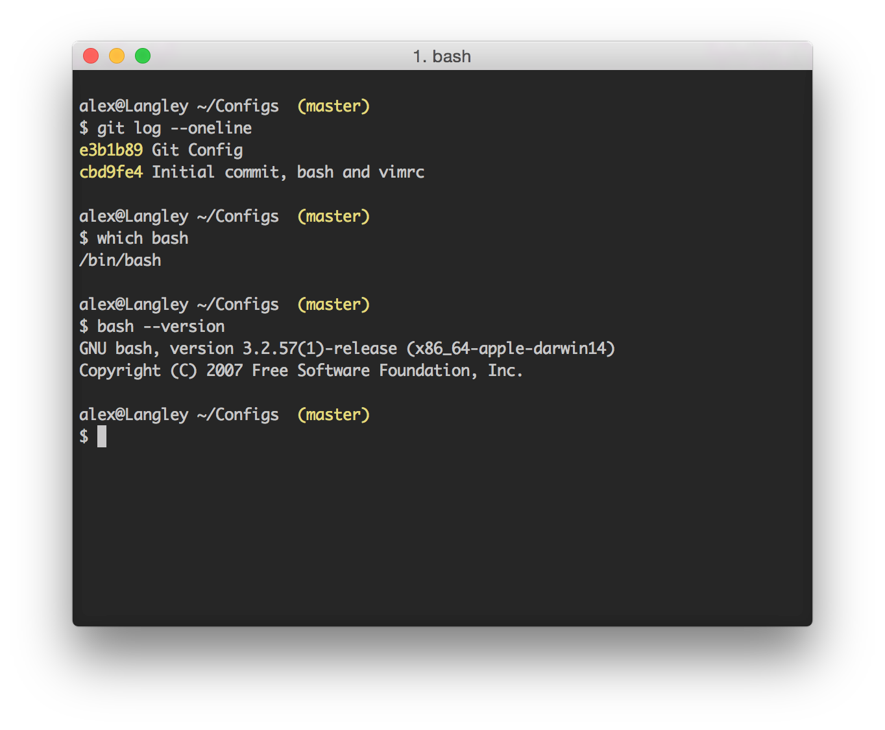

# File Konfigurasi

Repository ini mengandung semua file konfigurasi yang saya gunakan, diunggah untuk tujuan belajar dan berbagi. Untuk sekarang hanya ada tiga file konfigurasi:

1. Untuk bash (.bash_profile),
2. untuk vim  (.vimrc), dan
3. untuk git  (.gitconfig).

Semua file konfigurasi diuji di Mac OS X Yoshimite (10.10.3), dengan versi perangkat lunak sebagai berikut:

- VIM  : MacVim 7.3 (installed using homebrew)
- git  : git version 2.3.2 (Apple Git-55)
- bash : GNU bash, version 3.2.57(1)-release (x86_64-apple-darwin14) 

Berikut adalah tampilan dari terminal yang dihasilkan (dijalankan pada iTerm2):

