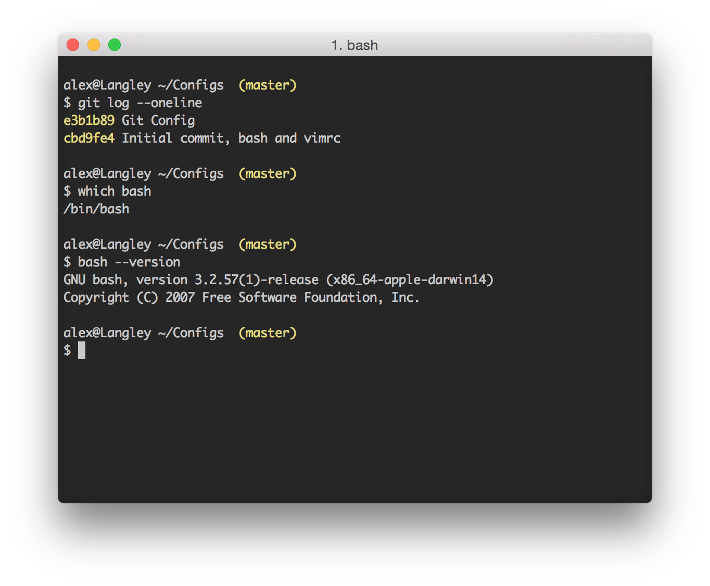

# Configuration files

This repo contains all my configuration files, useful both for learning and sharing. For now there are three configuration files available:

1. For bash (.bash_profile),
2. for vim  (.vimrc), and
3. for git  (.gitconfig).

All configurations are tested on Mac OS X Yoshimite (10.10.3), with the following software versions:

- VIM  : MacVim 7.4 (installed using homebrew)
- git  : git version 2.3.2 (Apple Git-55)
- bash : GNU bash, version 3.2.57(1)-release (x86_64-apple-darwin14) 

Here's some screenshot of the resulting terminal (running on iTerm2):

